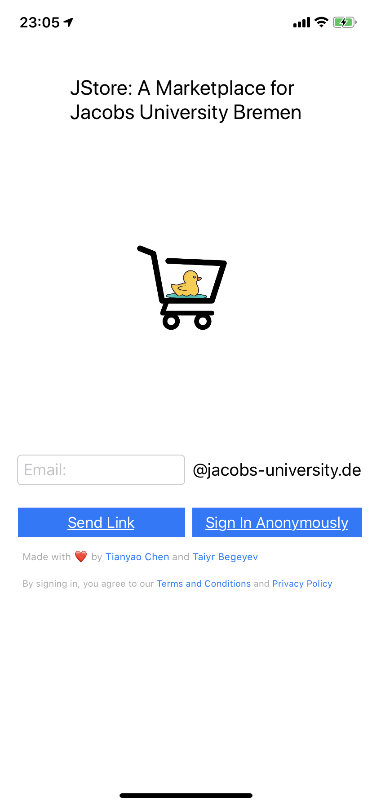

# JStore_iOS

* [JStore_iOS](#jstore_ios)
  * [About](#about)
  * [Current Status](#current-status)
  * [Tech Stack](#tech-stack)
  * [Screenshots](#screenshots)
  * [Storyboard](#storyboard)
  * [Enabled Features](#enabled-features)
  * [Credits](#credits)

## About

The iOS app for JStore: A Marketplace for Jacobs University Bremen. The [Web version](jstore.xyz) is developed by
my friend [Taiyr Begeyev](https://github.com/taiyrbegeyev). The [Android app](https://github.com/tillchen/JStore_iOS) is also finished.

## Current Status

You can get it on App Store!

## Tech Stack

* Firebase (Auth, Cloud Firestore (NoSQL), Storage (Google Cloud Platform))
* Swift
* iOS SDK
* FirebaseUI

## Screenshots

## Storyboard

## Enabled Features

* Automatic dark mode
* Email Link Sign-in with Dynamic Links
* Anonymous Sign-in
* Posting items with a picture (from gallery or taking a photo inside the app),
title, category, condition, description, price, and preferred payment options.
* Seeing the list of items posted in the descending order of creation time.
* Seeing the item's details, which also include two buttons (Email & WhatsApp) to contact the owner.
* Opening the detail page of an item directly from a link.
* Changing user info in the Me Section.
* Checking out your active posts and sold items in the Me Section.
* Marking your posts as sold or deleting them directly.
* Filtering by price (up or down), date (up or down), and categories.
* Simple searching for titles.

## Credits

Special thanks to:

* Taiyr Begeyev for collaborating on the database and storage design, terms and conditions, privacy policy, etc..
* Zeyar Oo for designing the icon.
